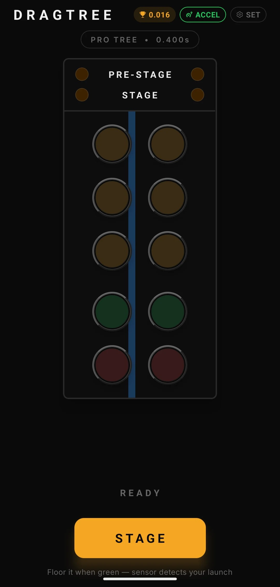
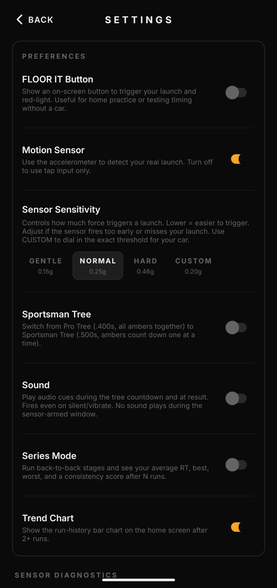

# DragTree — NHRA Pro Tree Reaction Timer

An Android app that simulates an NHRA Christmas Tree and measures your launch reaction time with the phone's accelerometer. Mount the phone on the dash, stage, watch the tree, and launch. The app detects the launch and records how quickly you reacted to the green. You don't need to tap anything.

Fully offline. No account, no ads, no network permission.

<p align="center">
  
  &nbsp;&nbsp;
  
</p>

## Get the app

| | |
|---|---|
| **F-Droid** | [f-droid.org/packages/com.flyboybyte.dragtree](https://f-droid.org/packages/com.flyboybyte.dragtree/) (reproducible build) |
| **Google Play** | [play.google.com/store/apps/details?id=com.flyboybyte.dragtree](https://play.google.com/store/apps/details?id=com.flyboybyte.dragtree) |
| **GitHub** | [Releases](https://github.com/flyboy-byte/drag-tree/releases) — per-ABI APKs (most phones: `arm64-v8a`) |

All three are signed with the same key, so you can switch between them without uninstalling.

## Features

- **Pro Tree** (.400) — all three ambers at once, green 0.400 s later
- **Sportsman Tree** (.500) — ambers count down one at a time, green 0.500 s after the last
- **Accelerometer launch detection** — no calibration; reaction time is measured from the start of acceleration, not from when the threshold was crossed
- **Sensitivity** — Gentle / Normal / Hard presets plus a custom threshold
- **Grading** — Perfect (≤ .049) · Pro (≤ .099) · Great (≤ .199) · Good (≤ .349) · Late · Red Light (with the actual time early)
- **Series mode** — 3, 5, or 10 runs with average, best, worst, red-light count, and a consistency read
- **History and trend chart** — last 30 runs, personal best highlighted
- **Audio cues** (optional) — amber click, green chirp, result ping, red-light buzz
- **Diagnostics** — live G-force, sample rate, and a breakdown of the last launch
- **FLOOR IT button** — simulated launch for practice without a car, or in a browser

The displayed RT is a launch-reaction estimate. Track time slips also include rollout and drivetrain response, so the app is best for training consistency rather than predicting a slip.

## How detection works

The app reads `DeviceMotion.acceleration`, which is linear acceleration with gravity already removed by Android's sensor fusion. That makes phone orientation irrelevant. A launch fires when the magnitude stays above the threshold for 5 consecutive samples (~40 ms at 125 Hz), which rejects bumps and taps. The app then walks back through a short sample buffer to find where the acceleration ramp began, and reports RT from that point.

| Preset | Threshold | Typical use |
|---|---|---|
| Gentle | 1.5 m/s² (~0.15 g) | FWD street car, light throttle |
| Normal | 2.5 m/s² (~0.25 g) | RWD / sport car (default) |
| Hard | 4.5 m/s² (~0.46 g) | Drag-prepped car, hard launch |

**Mounting:** use a rigid mount. A loose phone bounces on its own and gives bad readings. Hold still for about a second before tapping STAGE.

| Symptom | Fix |
|---|---|
| Fires on a bump before launch | Raise sensitivity (Normal / Hard) |
| Fires right after STAGE | Phone was moving when staged; hold still first |
| Never fires | Try Gentle; check the sample rate on the Diagnostics screen |

**Permissions:** only `HIGH_SAMPLING_RATE_SENSORS` (auto-granted, needed for >200 Hz sensor rates on Android 12+). Internet, microphone, and storage permissions are explicitly blocked.

## Build from source

Requires Node.js 18+.

```bash
git clone https://github.com/flyboy-byte/drag-tree.git
cd drag-tree
npm install

npm run web        # browser version (FLOOR IT button, no sensor)
npm test           # unit tests
npm run typecheck
```

Use `npm run web`, not `npx expo start`. npx may pull a different Expo version than the project's SDK 54.

**Android APK** — needs JDK 21, Android SDK 36 (build-tools 36.0.0), NDK 27.1.12297006, and Node on `PATH`:

```bash
cd android && ./gradlew assembleRelease
# → android/app/build/outputs/apk/release/app-release.apk
```

A signed build needs `android/local.properties` with keystore values (see `android/local.properties.example`).

F-Droid builds this app from source with a reproducible recipe. The release process and the lessons from getting there are in [`fdroid/`](fdroid/).

## Tech

Expo SDK 54 · React Native 0.81 (New Architecture) · expo-router · expo-sensors · expo-av · TypeScript. MIT license.
